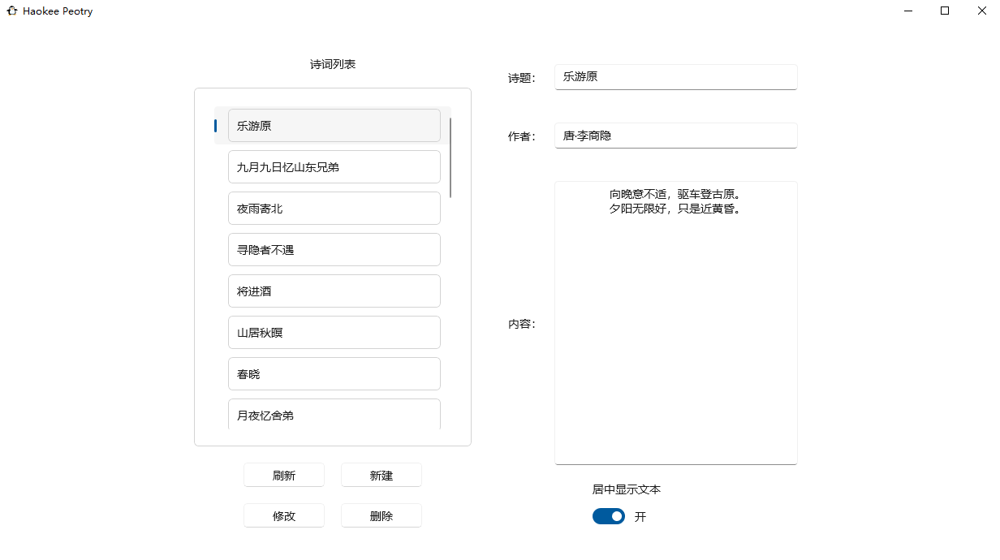

# Haokee Peotry

Haokee Peotry 是一个由好渴鹅编写的管理古诗词的 GUI 应用，采用 WinUI 3 进行编写，只支持较高版本 Windows 10 及以上的操作系统。在 Haokee Peotry，你可以方便地为您的古诗词库添加古诗词、修改或删除现有的古诗词，并在右侧预览已有的古诗词。

批量导入古诗词既可以使用 Haokee Peotry 单个单个导入，也可以将所有的古诗词文档全部放入应用程序同目录下的 AppData 文件夹内，注意至少需要三行，第一行为标题，第二行为作者，第三行及以后的内容为正文。注意编码格式均为 UTF-8，文件没有任何后缀名。

预览框可以通过底下的选项切换每一行是居中对其还是靠左，设置保存在应用程序同目录下的 text_center 文件内。

## 为什么使用 WinUI 3

因为作为一个实用工具（自认为的），它不需要过于好看的外观，但仍然需要迎合主流审美。（控制台应用自然不是的）WinUI 3 尽管控件较少、Bug 较多，但这确实给了我们这些想要好看的外观但又懒得折腾的开发者一定帮助。

至于 Electron 的话……由于鄙人不善前端开发，因此直接抛弃了。不过 WinUI 3 仍然有很大的缺点，比如编译后所有输出文件的总大小达到了 160 多千万字节，已经与 Electron 相差不远了。且 WinUI 3 对跨平台的支持不良，还必须是高版本 Windows 系统，因此本工具局限性很大。不过本来就没什么用，问题不大。

## 下载本软件

可以在 Release 页面下载，但是考虑到不适合中国宝宝的 Github，好渴鹅同步存放在了 123 云盘的 [链接](https://www.123684.com/s/OkLLVv-dasBH) 内。
